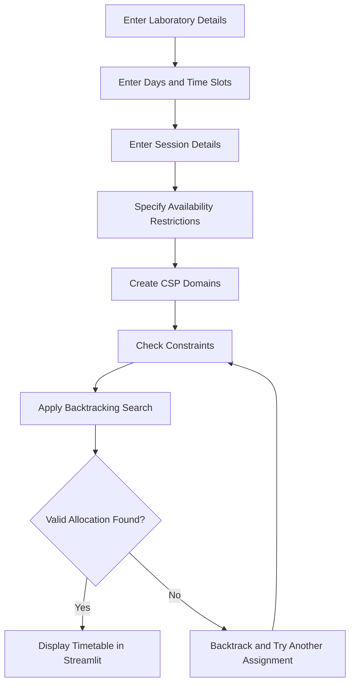
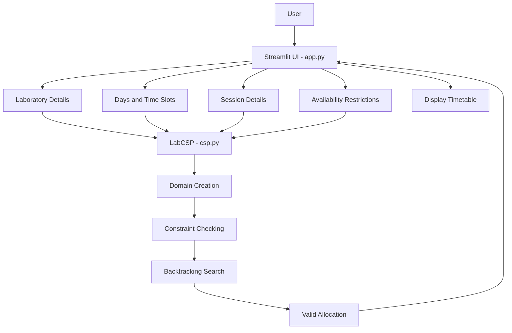
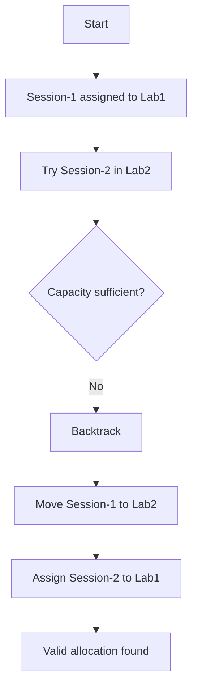
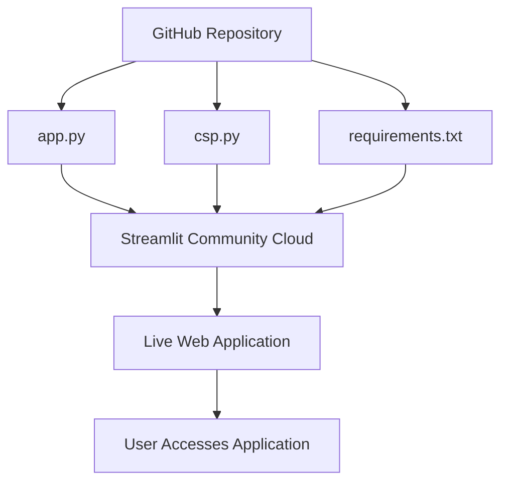
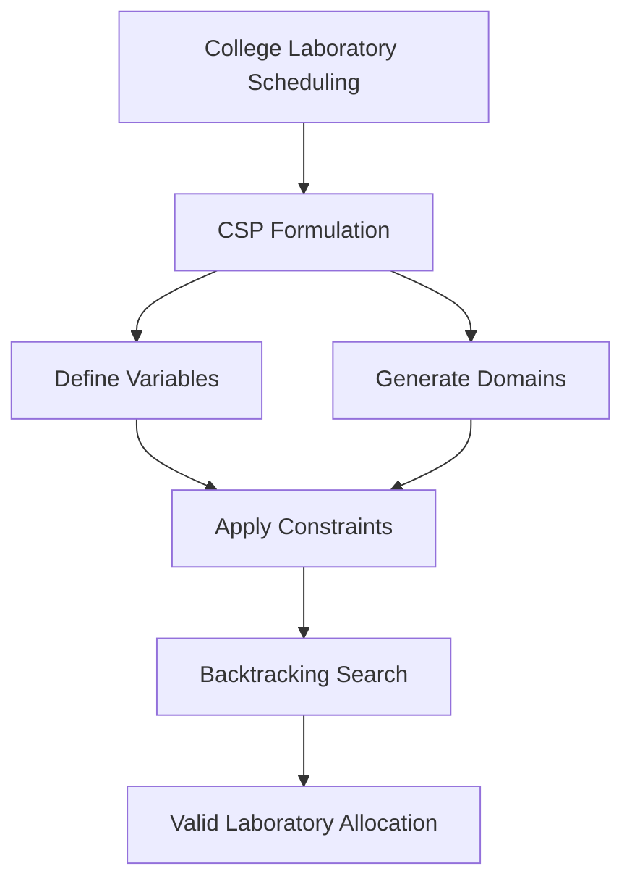

🧪 College Lab Slot Allocation Using CSP

A Constraint Satisfaction Problem (CSP)-based system that automatically allocates college laboratory sessions to available labs, days, and time slots according to predefined requirements and constraints.

🎓 An Artificial Intelligence PBL project demonstrating CSP-based resource allocation using Backtracking Search.

🌐 Live Application: College Lab Slot Allocation

📌 Project Overview

College laboratory scheduling involves assigning different batches and subjects to available laboratories, days, and time slots while satisfying several restrictions. Manual allocation becomes difficult when multiple laboratories, batches, faculty members, and time slots need to be coordinated simultaneously.

This project models college laboratory slot allocation as a Constraint Satisfaction Problem (CSP). Each laboratory session is represented as a variable, while possible combinations of days, laboratories, and time slots form its domain.

The system uses Backtracking Search to find a valid allocation while satisfying constraints such as laboratory capacity, laboratory availability, laboratory clashes, batch clashes, faculty availability, and faculty clashes.

A simple and user-friendly Streamlit interface is provided for entering laboratory, session, day, slot, and availability information.

🎯 Objectives
Model college laboratory slot allocation as a CSP.
Represent each laboratory session as a CSP variable.
Generate possible day, laboratory, and time-slot combinations.
Check laboratory capacity before assigning a session.
Consider laboratory availability.
Prevent multiple sessions from using the same laboratory simultaneously.
Prevent the same batch from having multiple sessions at the same time.
Consider faculty availability.
Prevent faculty clashes.
Use Backtracking Search to find a valid allocation.
Display the generated schedule through a simple Streamlit interface.
Deploy the application online using Streamlit Community Cloud.

## 🤖 CSP Concepts Used

A Constraint Satisfaction Problem consists of variables, domains, and constraints.

| CSP Component | Project Mapping                                      |
| ------------- | ---------------------------------------------------- |
| Variables     | Laboratory sessions such as Session-1 and Session-2  |
| Domains       | Possible day, laboratory, and time-slot combinations |
| Constraints   | Capacity, availability, and clash restrictions       |
| Solution      | A valid allocation for every laboratory session      |

### Example Domain

```text
Session-1:
(Monday, Lab1, 9-10)
(Monday, Lab2, 9-10)

Session-2:
(Monday, Lab1, 10-11)
(Tuesday, Lab1, 9-10)
```

✅ Implemented Constraints

The system checks the following conditions:

Laboratory capacity — the number of students must not exceed the capacity of the selected laboratory.
Laboratory availability — a laboratory must be available at the selected day and time slot.
Laboratory clash — two sessions cannot use the same laboratory at the same day and time.
Batch clash — the same batch cannot have two sessions at the same day and time.
Faculty availability — the assigned faculty member must be available at the selected day and time.
Faculty clash — the same faculty member cannot conduct two sessions at the same day and time.
## 🔄 System Workflow

The following flowchart illustrates the complete workflow of the laboratory slot allocation system.



🧠 CSP Domain Creation

For every laboratory session, the system generates all possible combinations of:

Day + Laboratory + Time Slot

For example, if there are:

Days:
Monday, Tuesday

Labs:
Lab1, Lab2

Slots:
9-10, 10-11

the possible combinations include:

(Monday, Lab1, 9-10)
(Monday, Lab1, 10-11)
(Monday, Lab2, 9-10)
(Monday, Lab2, 10-11)
(Tuesday, Lab1, 9-10)
(Tuesday, Lab1, 10-11)
...

The system then checks these possibilities against all constraints.

## 🔍 Backtracking Search

The solver selects an unassigned laboratory session and tries possible day, laboratory, and time-slot combinations. If a constraint is violated or no valid assignment is possible, it backtracks and tries another combination.


## 🏗️ System Architecture

The application separates the Streamlit user interface from the CSP solver implemented in `csp.py`.



The application interface is implemented in app.py, while the CSP logic and Backtracking Search are implemented in csp.py.

This separation keeps the user interface and the AI algorithm independent.

✨ Application Features
🧪 Laboratory Input

The application accepts:

Laboratory name
Laboratory capacity

Example:

Lab1 -> 40 students
Lab2 -> 60 students
📅 Days & Time Slots

The application accepts:

Available days
Available time slots

Example:

Days:
Monday, Tuesday

Time Slots:
9-10, 10-11, 11-12
👥 Session Input

Each laboratory session contains:

Batch
Subject
Number of students
Faculty

**Example:**

| Batch | Subject | Students | Faculty  |
| ----- | ------- | -------: | -------- |
| CSE-A | AI      |       35 | Faculty1 |
| CSE-B | DBMS    |       50 | Faculty2 |
| CSE-C | Python  |       30 | Faculty1 |

🚫 Availability

The user can mark specific laboratory or faculty time slots as unavailable.

By default, all entered laboratories and faculty members are considered available.

📋 Allocation Results

When the user selects Generate Allocation, the system checks the CSP constraints and displays the generated schedule.

Example:

| Batch | Subject | Faculty  | Day    | Lab  | Slot  |
| ----- | ------- | -------- | ------ | ---- | ----- |
| CSE-A | AI      | Faculty1 | Monday | Lab1 | 9-10  |
| CSE-B | DBMS    | Faculty2 | Monday | Lab2 | 9-10  |
| CSE-C | Python  | Faculty1 | Monday | Lab1 | 10-11 |

When a valid allocation is found, the application displays:

Valid allocation generated successfully.

If no valid allocation is possible, the application displays:

No valid allocation found.
Try adding more labs, days or slots.
🛠️ Technology Stack
Area	Technology
Programming language	Python
User interface	Streamlit
Data handling	Pandas
AI technique	Constraint Satisfaction Problem (CSP)
Search algorithm	Backtracking Search
Source code management	GitHub
Deployment	Streamlit Community Cloud

The current implementation uses in-memory data through Python and Pandas. No external database is required.


Laboratory input
Day and slot input
## 📂 Project Structure

```text
Lab-Slot-Allocation/
├── app.py
├── csp.py
├── requirements.txt
└── README.md
```

### `app.py`

The `app.py` file manages:

* Streamlit page configuration
* User interface
* Laboratory input
* Day and time-slot input
* Session input
* Availability input
* Calling the CSP engine
* Displaying the generated allocation

### `csp.py`

The `csp.py` file contains the `LabCSP` class and implements the core AI logic.

* Domain creation for laboratory sessions
* Laboratory capacity checking
* Laboratory availability checking
* Laboratory clash prevention
* Batch clash prevention
* Faculty availability checking
* Faculty clash prevention
* Constraint validation
* Backtracking Search

### `requirements.txt`

This file contains the external Python packages required to run the application.

```text
streamlit
pandas
```

---

## ⚙️ Installation

Follow these steps to set up the project locally.

**1. Clone the repository**

```bash
git clone https://github.com/prathyusha5992/Lab-Slot-Allocation.git
cd Lab-Slot-Allocation
```

**2. Create a virtual environment**

```bash
python -m venv .venv
```

**3. Activate the virtual environment**

Windows:

```powershell
.venv\Scripts\activate
```

Linux/macOS:

```bash
source .venv/bin/activate
```

**4. Install the dependencies**

```bash
pip install -r requirements.txt
```

---

## ▶️ Running the Application

Run the following command from the project root directory:

```bash
streamlit run app.py
```

The application will open in your default web browser. If it does not open automatically, use the local URL displayed in the terminal.

---

## 🧪 Sample Input

Use the following example to test the laboratory slot allocation system.

### Laboratories

| Laboratory | Capacity |
| ---------- | -------: |
| Lab1       |       40 |
| Lab2       |       60 |

### Days and Time Slots

| Type       | Values             |
| ---------- | ------------------ |
| Days       | Monday, Tuesday    |
| Time Slots | 9-10, 10-11, 11-12 |

### Laboratory Sessions

| Batch | Subject | Students | Faculty  |
| ----- | ------- | -------: | -------- |
| CSE-A | AI      |       35 | Faculty1 |
| CSE-B | DBMS    |       50 | Faculty2 |
| CSE-C | Python  |       30 | Faculty1 |

### Availability

Initially, all laboratories and faculty members are considered available, unless the user specifies otherwise.

The user can mark particular laboratory or faculty time slots as unavailable through the application interface.

---

## 📊 Sample Output

One possible valid allocation for the sample input is shown below.

| Batch | Subject | Faculty  | Day    | Lab  | Slot  |
| ----- | ------- | -------- | ------ | ---- | ----- |
| CSE-A | AI      | Faculty1 | Monday | Lab1 | 9-10  |
| CSE-B | DBMS    | Faculty2 | Monday | Lab2 | 9-10  |
| CSE-C | Python  | Faculty1 | Monday | Lab1 | 10-11 |

The allocation satisfies the laboratory capacity, availability, laboratory clash, batch clash, and faculty clash constraints.

The exact output may vary depending on the order of the domains and sessions.

---

## 👨‍🏫 Professor Demonstration Cases

The following test cases demonstrate how the CSP solver handles different scheduling situations.

### ✅ 1. Normal Allocation

**Input:**

| Laboratory | Capacity |
| ---------- | -------: |
| Lab1       |       40 |
| Lab2       |       60 |

| Batch | Subject | Students | Faculty  |
| ----- | ------- | -------: | -------- |
| CSE-A | AI      |       35 | Faculty1 |
| CSE-B | DBMS    |       50 | Faculty2 |

Days: Monday, Tuesday

Time slots: 9-10, 10-11

**Expected result:** Both sessions receive valid allocations without violating any constraints.

### ❌ 2. Insufficient Laboratory Capacity

**Input:**

| Laboratory | Capacity |
| ---------- | -------: |
| Lab1       |       30 |

| Batch | Subject | Students |
| ----- | ------- | -------: |
| CSE-A | AI      |       35 |

**Expected result:** The session cannot be assigned to Lab1 because the number of students exceeds the laboratory capacity.

```text
Students = 35
Lab1 capacity = 30

35 > 30
```

If no other suitable laboratory is available, the solver should report that no valid allocation exists.

### 🚫 3. Laboratory Clash

**Input:**

Two different sessions require the same laboratory at the same time.

| Batch | Subject | Faculty  | Day    | Lab  | Slot |
| ----- | ------- | -------- | ------ | ---- | ---- |
| CSE-A | AI      | Faculty1 | Monday | Lab1 | 9-10 |
| CSE-B | DBMS    | Faculty2 | Monday | Lab1 | 9-10 |

**Expected result:** Both sessions cannot use Lab1 on Monday from 9-10. The solver must assign a different valid slot or laboratory to one of the sessions.

### 👥 4. Batch Clash

**Input:**

| Batch | Subject |
| ----- | ------- |
| CSE-A | AI      |
| CSE-A | Python  |

**Expected result:** The two sessions belonging to CSE-A cannot be scheduled on the same day and at the same time.

### 👨‍🏫 5. Faculty Clash

**Input:**

| Batch | Subject | Faculty  |
| ----- | ------- | -------- |
| CSE-A | AI      | Faculty1 |
| CSE-C | Python  | Faculty1 |

**Expected result:** Faculty1 cannot conduct both sessions at the same day and time.

### 🚫 6. Unavailable Laboratory

**Input:**

```text
Laboratory: Lab1
Day: Monday
Slot: 9-10
Availability: Not Available
```

**Expected result:** The solver must not assign any session to Lab1 on Monday from 9-10.

### 👨‍🏫 7. Unavailable Faculty

**Input:**

```text
Faculty: Faculty1
Day: Monday
Slot: 9-10
Availability: Not Available
```

**Expected result:** Sessions conducted by Faculty1 must not be assigned to Monday from 9-10.

### 🔙 8. Backtracking Demonstration

This example demonstrates how Backtracking Search reverses an earlier assignment when it prevents a valid solution.

**Input:**

| Laboratory | Capacity |
| ---------- | -------: |
| Lab1       |       60 |
| Lab2       |       40 |

| Session   | Students |
| --------- | -------: |
| Session-1 |       35 |
| Session-2 |       50 |

Assume the solver initially assigns Session-1 to Lab1.

Session-2 then cannot use Lab2 because its capacity is only 40 students.

The solver backtracks and tries another assignment.



**Final allocation:**

| Session   | Students | Laboratory | Capacity |
| --------- | -------: | ---------- | -------: |
| Session-1 |       35 | Lab2       |       40 |
| Session-2 |       50 | Lab1       |       60 |

Both assignments satisfy the capacity constraints.

This demonstrates how Backtracking Search undoes a previous assignment and explores an alternative when the earlier choice leads to a conflict.

---

## 📚 Connection to the AI Syllabus

This project applies the concepts of Constraint Satisfaction Problems and Backtracking Search covered in the Artificial Intelligence syllabus.

| AI Concept                      | Implementation                                          |
| ------------------------------- | ------------------------------------------------------- |
| Constraint Satisfaction Problem | Laboratory scheduling modeled as a CSP                  |
| Variables                       | Individual laboratory sessions                          |
| Domains                         | Possible day, laboratory, and time-slot combinations    |
| Constraints                     | Capacity, availability, and clash restrictions          |
| Constraint Checking             | Validates each candidate assignment                     |
| Backtracking Search             | Reverses assignments when they lead to conflicts        |
| Solution                        | A valid laboratory timetable satisfying all constraints |

---

## 📈 Advantages

* Reduces manual laboratory scheduling effort.
* Prevents laboratory scheduling conflicts.
* Avoids simultaneous sessions for the same batch.
* Prevents faculty scheduling conflicts.
* Checks laboratory capacity requirements.
* Considers laboratory and faculty availability.
* Provides a simple, user-friendly interface.
* Can be accessed through a web browser after deployment.
* Demonstrates the practical application of AI concepts.

---

## ⚠️ Limitations

This project is a simplified academic prototype. The current implementation does not include:

* Database integration or persistent storage.
* Automatic timetable optimization.
* Faculty preference management.
* Batch priority handling.
* Automatic schedule export to PDF or Excel.
* Advanced CSP heuristics such as Minimum Remaining Values (MRV).
* Large-scale scheduling optimization.
* Historical schedule storage.

The current scope focuses on CSP formulation, constraint checking, and Backtracking Search.

---

## 🚀 Future Enhancements

The project can be extended with the following features:

* Integrating a database to store schedules.
* Exporting timetables as PDF or Excel files.
* Supporting faculty and laboratory preferences.
* Optimizing schedules to reduce idle slots.
* Implementing advanced CSP heuristics such as MRV.
* Supporting larger numbers of batches and laboratories.
* Adding visual timetable representations.
* Providing detailed explanations when an allocation is impossible.

These enhancements are outside the scope of the current implementation.

---

## 🌐 Deployment

The application is deployed using Streamlit Community Cloud. The platform runs the application using the source code and dependencies maintained in the GitHub repository.

### Deployment Workflow



**Live Application:** [College Lab Slot Allocation](https://lab-slot-allocation-exeifcnltoy6cpcagpp4cc.streamlit.app/)

---

## 📊 Project Status

| Component                          | Status   |
| ---------------------------------- | -------- |
| CSP problem formulation            | Complete |
| Domain generation                  | Complete |
| Laboratory capacity constraint     | Complete |
| Laboratory availability constraint | Complete |
| Laboratory clash constraint        | Complete |
| Batch clash constraint             | Complete |
| Faculty availability constraint    | Complete |
| Faculty clash constraint           | Complete |
| Backtracking Search                | Complete |
| Streamlit user interface           | Complete |
| Sample data                        | Complete |
| GitHub repository                  | Complete |
| Streamlit deployment               | Complete |

---

## 🎓 Academic Scope

The project demonstrates how an AI-based Constraint Satisfaction Problem can solve a real-world college laboratory scheduling problem.

### Overall Problem-Solving Process



The project focuses on understanding CSP variables, domains, constraints, constraint checking, and Backtracking Search using Python.

---


## 📌 Conclusion

College Lab Slot Allocation using CSP demonstrates how a real-world scheduling problem can be modeled and solved using Artificial Intelligence techniques.

Each laboratory session is represented as a CSP variable, while possible combinations of days, laboratories, and time slots form its domain. Constraints ensure that laboratory capacity, availability, laboratory clashes, batch clashes, faculty availability, and faculty clashes are considered during allocation.

The Backtracking Search algorithm explores possible assignments and reverses previous choices when they lead to conflicts. A Streamlit interface allows users to enter scheduling information and view the generated timetable.

The project provides a practical demonstration of Constraint Satisfaction Problems and Backtracking Search for college laboratory scheduling.

## 👩‍💻 Author

**P. Lakshmi Prathyusha**

Artificial Intelligence and Machine Learning Student

Geethanjali College of Engineering and Technology, Hyderabad
