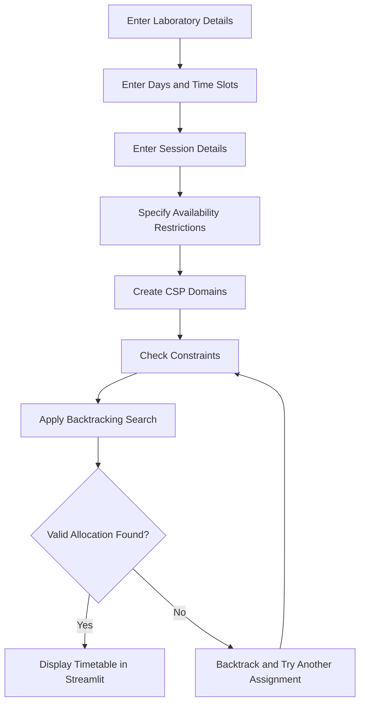
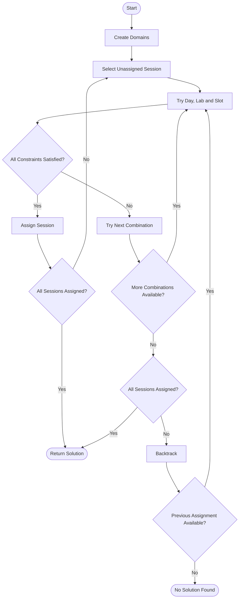
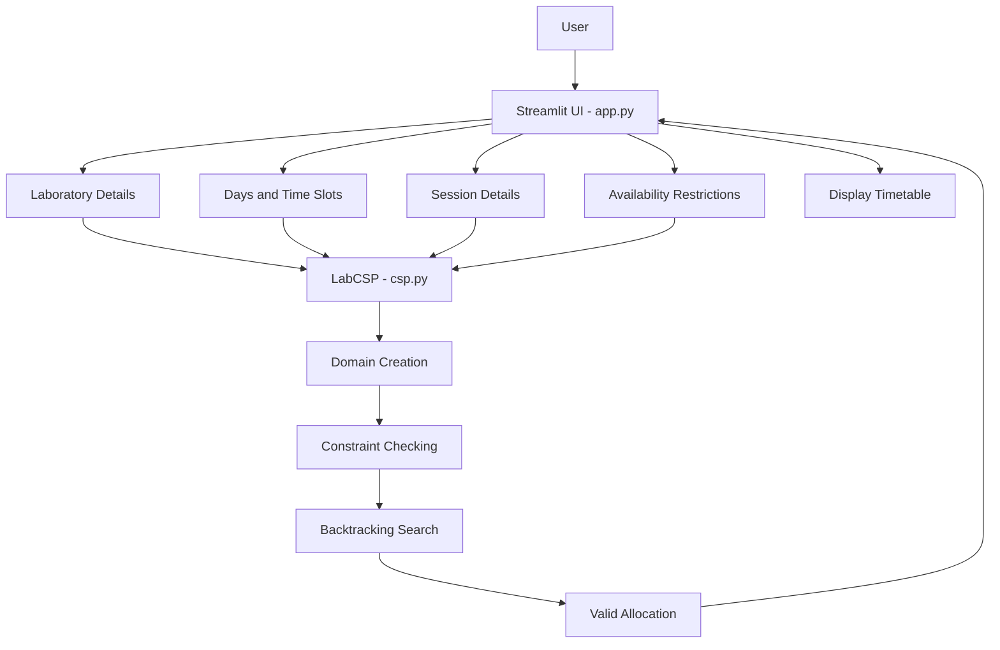
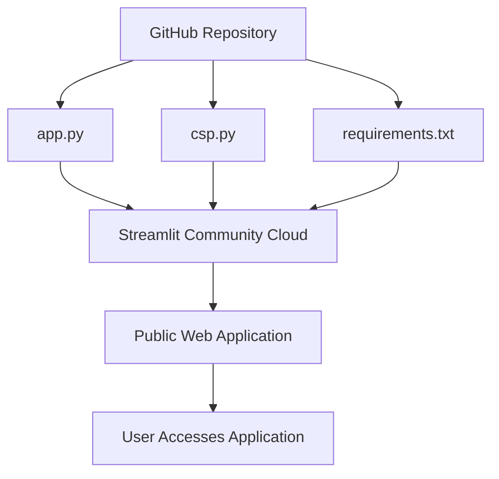

🧪 College Lab Slot Allocation Using CSP

A Constraint Satisfaction Problem (CSP)-based system that automatically allocates college laboratory sessions to available labs, days, and time slots according to predefined requirements and constraints.

🎓 An Artificial Intelligence PBL project demonstrating CSP-based resource allocation using Backtracking Search.

🌐 Live Application: College Lab Slot Allocation

📌 Project Overview

College laboratory scheduling involves assigning different batches and subjects to available laboratories, days, and time slots while satisfying several restrictions. Manual allocation becomes difficult when multiple laboratories, batches, faculty members, and time slots need to be coordinated simultaneously.

This project models college laboratory slot allocation as a Constraint Satisfaction Problem (CSP). Each laboratory session is represented as a variable, while possible combinations of days, laboratories, and time slots form its domain.

The system uses Backtracking Search to find a valid allocation while satisfying constraints such as laboratory capacity, laboratory availability, laboratory clashes, batch clashes, faculty availability, and faculty clashes.

A simple and user-friendly Streamlit interface is provided for entering laboratory, session, day, slot, and availability information.

🎯 Objectives
Model college laboratory slot allocation as a CSP.
Represent each laboratory session as a CSP variable.
Generate possible day, laboratory, and time-slot combinations.
Check laboratory capacity before assigning a session.
Consider laboratory availability.
Prevent multiple sessions from using the same laboratory simultaneously.
Prevent the same batch from having multiple sessions at the same time.
Consider faculty availability.
Prevent faculty clashes.
Use Backtracking Search to find a valid allocation.
Display the generated schedule through a simple Streamlit interface.
Deploy the application online using Streamlit Community Cloud.

## 🤖 CSP Concepts Used

A Constraint Satisfaction Problem consists of variables, domains, and constraints.

| CSP Component | Project Mapping                                      |
| ------------- | ---------------------------------------------------- |
| Variables     | Laboratory sessions such as Session-1 and Session-2  |
| Domains       | Possible day, laboratory, and time-slot combinations |
| Constraints   | Capacity, availability, and clash restrictions       |
| Solution      | A valid allocation for every laboratory session      |

### Example Domain

```text
Session-1:
(Monday, Lab1, 9-10)
(Monday, Lab2, 9-10)

Session-2:
(Monday, Lab1, 10-11)
(Tuesday, Lab1, 9-10)
```

✅ Implemented Constraints

The system checks the following conditions:

Laboratory capacity — the number of students must not exceed the capacity of the selected laboratory.
Laboratory availability — a laboratory must be available at the selected day and time slot.
Laboratory clash — two sessions cannot use the same laboratory at the same day and time.
Batch clash — the same batch cannot have two sessions at the same day and time.
Faculty availability — the assigned faculty member must be available at the selected day and time.
Faculty clash — the same faculty member cannot conduct two sessions at the same day and time.
## 🔄 System Workflow

The following flowchart illustrates the complete workflow of the laboratory slot allocation system.



🧠 CSP Domain Creation

For every laboratory session, the system generates all possible combinations of:

Day + Laboratory + Time Slot

For example, if there are:

Days:
Monday, Tuesday

Labs:
Lab1, Lab2

Slots:
9-10, 10-11

the possible combinations include:

(Monday, Lab1, 9-10)
(Monday, Lab1, 10-11)
(Monday, Lab2, 9-10)
(Monday, Lab2, 10-11)
(Tuesday, Lab1, 9-10)
(Tuesday, Lab1, 10-11)
...

The system then checks these possibilities against all constraints.

## 🔍 Backtracking Search

The solver selects an unassigned laboratory session and tries possible day, laboratory, and time-slot combinations. If a constraint is violated or no valid assignment is possible, it backtracks and tries another combination.



## 🏗️ System Architecture

The application separates the Streamlit user interface from the CSP solver implemented in `csp.py`.



The application interface is implemented in app.py, while the CSP logic and Backtracking Search are implemented in csp.py.

This separation keeps the user interface and the AI algorithm independent.

✨ Application Features
🧪 Laboratory Input

The application accepts:

Laboratory name
Laboratory capacity

Example:

Lab1 -> 40 students
Lab2 -> 60 students
📅 Days & Time Slots

The application accepts:

Available days
Available time slots

Example:

Days:
Monday, Tuesday

Time Slots:
9-10, 10-11, 11-12
👥 Session Input

Each laboratory session contains:

Batch
Subject
Number of students
Faculty

Example:

CSE-A -> AI -> 35 students -> Faculty1
CSE-B -> DBMS -> 50 students -> Faculty2
CSE-C -> Python -> 30 students -> Faculty1
🚫 Availability

The user can mark specific laboratory or faculty time slots as unavailable.

By default, all entered laboratories and faculty members are considered available.

📋 Allocation Results

When the user selects Generate Allocation, the system checks the CSP constraints and displays the generated schedule.

Example:

Batch   Subject   Faculty    Day       Lab    Slot
CSE-A   AI        Faculty1   Monday    Lab1   9-10
CSE-B   DBMS      Faculty2   Monday    Lab2   9-10
CSE-C   Python    Faculty1   Monday    Lab1   10-11

When a valid allocation is found, the application displays:

Valid allocation generated successfully.

If no valid allocation is possible, the application displays:

No valid allocation found.
Try adding more labs, days or slots.
🛠️ Technology Stack
Area	Technology
Programming language	Python
User interface	Streamlit
Data handling	Pandas
AI technique	Constraint Satisfaction Problem (CSP)
Search algorithm	Backtracking Search
Source code management	GitHub
Deployment	Streamlit Community Cloud

The current implementation uses in-memory data through Python and Pandas. No external database is required.

📂 Project Structure
Lab-Slot-Allocation/
|
|-- app.py
|-- csp.py
|-- requirements.txt
`-- README.md
app.py

The app.py file manages:

Streamlit page configuration
User interface
Laboratory input
Day and slot input
Session input
Availability input
Calling the CSP engine
Displaying the generated allocation
csp.py

The csp.py file contains the LabCSP class and implements:

Domain creation
Laboratory capacity checking
Laboratory availability checking
Laboratory clash checking
Batch clash checking
Faculty availability checking
Faculty clash checking
Constraint validation
Backtracking Search
requirements.txt

Contains the external Python packages required to run the application.

streamlit
pandas
⚙️ Installation
Clone or download the project and open its root directory.
Create a virtual environment:
python -m venv .venv
Activate the virtual environment.

Windows:

.venv\Scripts\activate

Linux/macOS:

source .venv/bin/activate
Install the dependencies:
pip install -r requirements.txt
▶️ Running the Application

From the project root, run:

streamlit run app.py

The Streamlit application will start and open in a browser.

🧪 Sample Input
Laboratories
Lab1 -> Capacity: 40
Lab2 -> Capacity: 60
Days
Monday, Tuesday
Time Slots
9-10, 10-11, 11-12
Sessions
Batch	Subject	Students	Faculty
CSE-A	AI	35	Faculty1
CSE-B	DBMS	50	Faculty2
CSE-C	Python	30	Faculty1
Availability

Initially:

All laboratories -> Available
All faculty -> Available

The user can optionally mark specific laboratory or faculty slots as unavailable.

📊 Sample Output

For the sample input, one possible valid allocation is:

Batch	Subject	Faculty	Day	Lab	Slot
CSE-A	AI	Faculty1	Monday	Lab1	9-10
CSE-B	DBMS	Faculty2	Monday	Lab2	9-10
CSE-C	Python	Faculty1	Monday	Lab1	10-11

The exact allocation may vary depending on the order of the entered data and available combinations.

👨‍🏫 Professor Demonstration Cases
✅ 1. Normal Allocation
Labs:
Lab1 -> 40
Lab2 -> 60

Sessions:
CSE-A -> AI -> 35 -> Faculty1
CSE-B -> DBMS -> 50 -> Faculty2

Days:
Monday, Tuesday

Slots:
9-10, 10-11

Expected: Both sessions receive different valid laboratory slots without violating any constraint.

❌ 2. Insufficient Laboratory Capacity
Labs:
Lab1 -> 30

Session:
CSE-A -> AI -> 35 students

Expected: The session cannot be assigned to Lab1 because:

35 > 30
🚫 3. Laboratory Clash
Sessions:
CSE-A -> AI -> Faculty1
CSE-B -> DBMS -> Faculty2

Available:
Lab1 -> Monday 9-10

Expected: Both sessions cannot use Lab1 at Monday 9-10 simultaneously.

👥 4. Batch Clash
Sessions:
CSE-A -> AI
CSE-A -> Python

Expected: The two sessions belonging to CSE-A cannot be assigned to the same day and time.

👨‍🏫 5. Faculty Clash
Sessions:
CSE-A -> AI -> Faculty1
CSE-C -> Python -> Faculty1

Expected: Faculty1 cannot be assigned to both sessions at the same day and time.

🚫 6. Unavailable Laboratory
Lab1 -> Monday 9-10 -> Not Available

Expected: The solver does not assign any session to Lab1 at Monday 9-10.

👨‍🏫 7. Unavailable Faculty
Faculty1 -> Monday 9-10 -> Not Available

Expected: Sessions conducted by Faculty1 are not assigned to Monday 9-10.

🔙 8. Backtracking Demonstration

Consider:

Lab1 -> Capacity 60
Lab2 -> Capacity 40

Session-1 -> 35 students
Session-2 -> 50 students

If the solver initially assigns Session-1 to Lab1, Session-2 may not be able to use Lab2 because its capacity is only 40.

The solver then:

Initial choice
Session-1 -> Lab1
        |
        v
Session-2 cannot be assigned
        |
        v
Backtrack
        |
        v
Try another assignment
Session-1 -> Lab2
Session-2 -> Lab1

The second assignment satisfies the capacity constraints.

This demonstrates how Backtracking Search can undo an earlier assignment and try another possibility.

📚 Connection to the AI Syllabus

This project demonstrates core concepts of Constraint Satisfaction Problems and Backtracking Search.

AI topic	Implementation in this project
Constraint Satisfaction Problems	Laboratory scheduling is formulated as a CSP
Variables	Each laboratory session is a variable
Domains	Possible Day-Lab-Slot combinations
Constraints	Capacity, availability, lab, batch, and faculty restrictions
Backtracking Search	Searches possible assignments and reverses invalid choices
Constraint checking	Every candidate assignment is checked before acceptance
📈 Advantages
Reduces manual laboratory scheduling effort.
Prevents laboratory clashes.
Prevents batch clashes.
Prevents faculty clashes.
Checks laboratory capacity.
Considers laboratory availability.
Considers faculty availability.
Provides a simple user-friendly interface.
Can be accessed through a web browser after deployment.
Demonstrates practical application of AI concepts.
⚠️ Limitations

This is a simplified academic prototype. It does not currently include:

Database or persistent storage.
Automatic timetable optimization.
Faculty preference management.
Batch priority handling.
Automatic schedule export.
Advanced CSP heuristics.
Large-scale scheduling optimization.
Historical schedule storage.

The current system focuses specifically on CSP modeling and Backtracking Search as required for the academic project.

🚀 Future Enhancements

Possible future improvements include:

Database integration for storing schedules.
Downloading the generated timetable as PDF or Excel.
Adding faculty preferences.
Adding laboratory preferences.
Adding automatic schedule optimization.
Adding more advanced CSP heuristics such as MRV.
Supporting larger numbers of batches and laboratories.
Adding timetable visualization.
Providing detailed explanations when an allocation is not possible.

These features are outside the scope of the current implementation.

## 🌐 Deployment

The application is deployed using Streamlit Community Cloud, which runs the application from the GitHub repository.



**Live Application:** [College Lab Slot Allocation](https://lab-slot-allocation-exeifcnltoy6cpcagpp4cc.streamlit.app/)

🌐 Live Application: College Lab Slot Allocation

📊 Project Status
Component	Status
CSP problem formulation	✅ Complete
Domain generation	✅ Complete
Laboratory capacity constraint	✅ Complete
Laboratory availability constraint	✅ Complete
Laboratory clash constraint	✅ Complete
Batch clash constraint	✅ Complete
Faculty availability constraint	✅ Complete
Faculty clash constraint	✅ Complete
Backtracking Search	✅ Complete
Streamlit UI	✅ Complete
Sample data	✅ Complete
GitHub repository	✅ Complete
Streamlit deployment	✅ Complete
🎓 Academic Scope

The project demonstrates how an AI-based Constraint Satisfaction Problem can be applied to a real-world college scheduling problem.

College Lab Scheduling Problem
              |
              v
       CSP Formulation
              |
       +------+------+
       |             |
   Variables       Domains
       |             |
       +------+------+
              |
              v
         Constraints
              |
              v
      Backtracking Search
              |
              v
      Valid Lab Allocation

The project focuses on understanding and implementing CSP variables, domains, constraints, constraint checking, and Backtracking Search using Python.

👨‍💻 Authors

P. Lakshmi Prathyusha - 24R11A6680

📌 Conclusion

College Lab Slot Allocation using CSP demonstrates how a real-world scheduling problem can be modeled and solved using Artificial Intelligence techniques.

Each laboratory session is represented as a CSP variable, while possible combinations of days, laboratories, and time slots form the domain. Multiple constraints are applied to ensure that laboratory capacity, availability, laboratory clashes, batch clashes, faculty availability, and faculty clashes are satisfied.

The Backtracking Search algorithm systematically explores possible assignments and reverses previous choices when they lead to conflicts. A simple Streamlit interface allows users to enter the required information and view the generated allocation.

The project therefore provides a practical demonstration of Constraint Satisfaction Problems and Backtracking Search for college laboratory scheduling.
